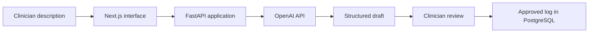

# Ikechukwu Chukwudi
### NHS cardiology registrar · Clinical AI builder · Medical LLM reviewer
**MB;BS, MRCP(UK) | United Kingdom**

[View the portfolio](https://realikechukwu.github.io/about/) · [LinkedIn](https://www.linkedin.com/in/ikechukwu-chukwudi/)

I build software around problems I encounter in clinical practice. My work combines NHS cardiology and acute medicine, cardiovascular research, medical LLM review, and hands-on product development.

## Selected projects

| Project | What I built | Reach at 1 October 2026 | Explore |
|---|---|---|---|
| **Clinote** | AI-assisted professional logbook; end-to-end build with Next.js, FastAPI, PostgreSQL and the OpenAI API | **50 users** | [Watch demo](https://realikechukwu.github.io/about/#clinote-demo) · [Case study](case-studies/clinote.md) · [Live product](https://clinote.co/) |
| **Cardiology Research Digest** | Automated cardiology literature discovery, AI-assisted summaries and email delivery | **70 subscribers** | [Case study](case-studies/cardiology-digest.md) |

The source code for both applications is private. These public case studies explain the problems, workflows, implementation and my contribution without exposing application code or user data.

## Clinote: from description to structured log

I built Clinote end to end. A clinician describes a procedure or clinical experience; the OpenAI API helps turn that description into a structured draft. The clinician reviews it before saving.

**[Watch the 23-second product demo →](https://realikechukwu.github.io/about/#clinote-demo)**

The recording uses synthetic demonstration data and shows dictation, text review, structured extraction, saving and the timeline.

I implemented the application and AI integration using **Next.js, FastAPI and PostgreSQL**, and refined the prompts over multiple iterations to improve consistency with the required output structure. I use AI-assisted coding and take responsibility for the implementation and product decisions.

*High-level workflow; not a detailed deployment or security diagram.*

Clinote is intended for anonymised professional training logs. The [published product workflow](https://clinote.co/) requires review before saving and tells users not to enter patient identifiers. Formal benchmark results and measured time savings are not claimed here.

[Read the Clinote case study →](case-studies/clinote.md)

## Cardiology Research Digest: literature to inbox

I developed an automated research digest to make cardiology literature easier to follow. The workflow brings together PubMed discovery, filtering, AI-assisted abstract summaries and email delivery. It has **70 subscribers** as of 1 October 2026.

The case study explains the pipeline and the distinction between helping clinicians discover research and making clinical recommendations.

[Read the digest case study →](case-studies/cardiology-digest.md)

## Clinical, research and model-review experience

- **NHS cardiology registrar**, with clinical experience across cardiology and acute medicine.
- **Honorary Clinical Fellow, University of Liverpool**; former NIHR Academic Clinical Fellow.
- **Medical reviewer, Outlier / Scale AI (September 2025–March 2026):** reviewed medical annotations and LLM outputs against clinical accuracy and completeness rubrics, including cardiology and ECG reasoning; provided written feedback to annotators.
- **Research and data work:** cardiovascular health-data analysis, systematic reviews and meta-analysis using Python and R.

## Discussing the work

I can walk through my implementation choices and prompt iteration, and demonstrate Clinote using synthetic information. This repository contains explanatory material; it does not contain the private applications or a clinical validation study.

[LinkedIn](https://www.linkedin.com/in/ikechukwu-chukwudi/) · [ORCID](https://orcid.org/0000-0002-0646-5031) · [GitHub](https://github.com/realikechukwu) · [Portfolio page source](index.html)

*Project counts are my reported totals at 1 October 2026. “Users” does not imply active or paying users; subscribers does not imply a measured readership rate.*
