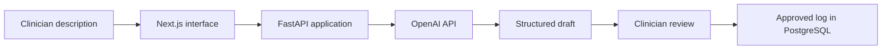

# Ikechukwu Chukwudi
### NHS cardiology registrar · Clinical AI builder · Medical LLM reviewer
**MB;BS, MRCP(UK) | United Kingdom**

[View the portfolio](https://realikechukwu.github.io/about/) · [LinkedIn](https://www.linkedin.com/in/ikechukwu-chukwudi/)

I build software for problems I run into at work. Day to day I'm a cardiology registrar; outside that I do cardiovascular research, review medical LLM outputs, and build products.

## Projects

| Project | What it is | Reach (Oct 2026) | Links |
|---|---|---|---|
| **Clinote** | AI-assisted logbook for clinicians. Next.js, FastAPI, PostgreSQL, OpenAI API | **50 users** | [Demo](https://realikechukwu.github.io/about/#clinote-demo) · [Case study](case-studies/clinote.md) · [clinote.co](https://clinote.co/) |
| **Cardiology Research Digest** | Weekly email of new cardiology papers, found and summarised automatically | **70 subscribers** | [Landing page](https://digest.realikechukwu.com/) · [Sample issue](https://digest.realikechukwu.com/sample) · [Case study](case-studies/cardiology-digest.md) |

Both codebases are private, so the case studies cover how they work instead.

## Clinote

You describe a procedure or case in your own words, Clinote turns it into a structured log entry, and you check it before saving.

**[Watch the demo](https://realikechukwu.github.io/about/#clinote-demo)**

I built it end to end with **Next.js, FastAPI and PostgreSQL**, using the OpenAI API for the extraction step, and went through a lot of prompt iterations to get the output structure consistent.

It's for anonymised training logs only, and users are told not to enter patient identifiers.

[Read the Clinote case study](case-studies/clinote.md)

## Cardiology Research Digest

A weekly email that pulls new cardiology papers from PubMed, filters them, and summarises each abstract. It has **70 subscribers**.

[Read the digest case study](case-studies/cardiology-digest.md) · [Landing page](https://digest.realikechukwu.com/) · [Sample issue](https://digest.realikechukwu.com/sample)

## Background

- **Cardiology registrar**, NHS, with experience across cardiology and acute medicine.
- **Honorary Clinical Fellow, University of Liverpool**; previously NIHR Academic Clinical Fellow.
- **Medical reviewer, Outlier / Scale AI (Sep 2025 – Mar 2026):** graded medical annotations and LLM outputs for clinical accuracy, including cardiology and ECG reasoning.
- **Research:** cardiovascular health-data analysis, systematic reviews and meta-analysis in Python and R.

## Get in touch

Happy to walk through either project or demo Clinote live.

[LinkedIn](https://www.linkedin.com/in/ikechukwu-chukwudi/) · [ORCID](https://orcid.org/0000-0002-0646-5031) · [GitHub](https://github.com/realikechukwu)
