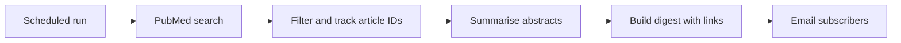

# Cardiology Research Digest
## New cardiology papers, summarised and emailed weekly

**Ikechukwu Chukwudi | 70 subscribers as of October 2026**

[Landing page](https://digest.realikechukwu.com/) · [Sample issue](https://digest.realikechukwu.com/sample) · [Portfolio](../README.md) · [LinkedIn](https://www.linkedin.com/in/ikechukwu-chukwudi/)

## The problem

Keeping up with cardiology research is hard alongside clinical work. Finding papers, deciding which matter, and getting the main point out of each are three separate jobs, and they rarely get done.

So I automated it.

## What I built

A **Python** pipeline that runs on a schedule with **GitHub Actions**. It searches **PubMed** for new papers, filters them, summarises each abstract with the **OpenAI API**, and emails the digest to subscribers.

| Stage | What happens |
|---|---|
| Search | Pull new article metadata and abstracts from PubMed |
| Filter | Keep the relevant papers and record their IDs so they don't show up twice |
| Summarise | Turn each abstract into a short summary in a fixed format |
| Send | Put the issue together and email it |

## Limits of the summaries

Summaries are based on the abstract only, and abstracts often leave out a study's weaknesses. The digest is meant to point you at papers worth reading, not replace reading them.

## What's next

I want to check a sample of summaries against their abstracts for:

- Findings or recommendations that aren't in the source, or claims stated more strongly than the paper does.
- Wrong study design, population, intervention, comparator or numbers.
- Missing limitations, or association presented as causation.
- Broken or wrong links.
- Duplicate articles and failed sends.

[Back to the portfolio](../README.md)
