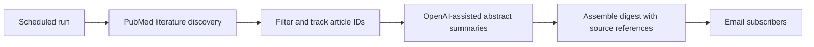

# Cardiology Research Digest
## An automated literature-to-email workflow for cardiology

**Ikechukwu Chukwudi | Literature workflow and automation | 70 subscribers at 1 October 2026**

[Portfolio](../README.md) · [LinkedIn](https://www.linkedin.com/in/ikechukwu-chukwudi/)

## The problem

Keeping up with cardiology research competes with clinical work, training and other commitments. Finding a paper, deciding whether it is relevant and understanding its main point are separate tasks.

I developed an automated cardiology research digest to help bring relevant literature into subscribers' inboxes.

## What I built

The project combines literature discovery, filtering, AI-assisted abstract summaries and email delivery. The documented implementation uses **Python**, **PubMed**, the **OpenAI API** and **Gmail**, with scheduled runs through **GitHub Actions**.

The digest has **70 subscribers** as of 1 October 2026. This is a subscriber count; I do not claim an open rate, a measured change in practice or a clinical outcome.

## The workflow

*Simplified pipeline overview. The private implementation is not reproduced here.*

| Stage | Purpose |
|---|---|
| Discover literature | Retrieve article metadata and abstracts from PubMed |
| Filter and track | Narrow the candidate literature and track article identifiers |
| Summarise | Turn abstracts into a consistent, readable digest format using the OpenAI API |
| Deliver | Assemble the selected material and send it by email |

The pipeline's article tracking is a mechanism for reducing repeat content; this case study makes no guarantee of perfect deduplication or delivery.

## My contribution

I developed the digest workflow and automation. The project connects my clinical interest in cardiology with practical software work: turning literature retrieval and summarisation into a service with subscribers.

I use AI-assisted coding. I can discuss the pipeline, model integration and implementation choices during a technical walkthrough. The source code and subscriber information remain private.

## What the AI is doing

The model helps summarise source abstracts. It does not independently establish study quality, reproduce a systematic review or turn a research finding into a treatment recommendation.

An abstract may omit important limitations from the full paper. A digest summary is therefore a route into the literature, and readers need the original article to assess methods, applicability and uncertainty.

## Quality questions and next evaluation

A useful evaluation would compare a sample of summaries with their source abstracts, looking for:

- Unsupported findings, recommendations or changes in the strength of a claim.
- Incorrect study design, population, intervention, comparator or numerical results.
- Missing limitations and confusion between association and causation.
- Broken or mismatched source references.
- Repeat articles and incomplete delivery.

These are **proposed evaluation criteria**. I have not published a scored summary evaluation, engagement analytics or clinical validation results in this case study.

## Evidence at a glance

| Evidence | Current position |
|---|---|
| Project contribution | Literature-to-email workflow and automation |
| Documented implementation | Python, PubMed, OpenAI API, Gmail, GitHub Actions |
| Adoption | 70 subscribers at 1 October 2026 |
| Public source code | Private application repository |
| Evaluation and outcomes | No quantified quality, readership or clinical-impact claims here |

## Discussing the project

I can explain the retrieval-to-email pipeline and the choices involved in making literature summaries useful to clinicians. This public case study contains no subscriber records, credentials or private application code.

[Back to selected work](../README.md)
