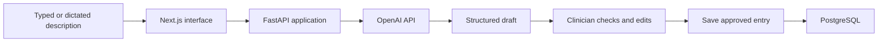

# Clinote
## An AI-assisted professional logbook built by a practising clinician

**Ikechukwu Chukwudi | End-to-end application development | 50 users at 1 October 2026**

[Live product](https://clinote.co/) · [Portfolio](../README.md) · [LinkedIn](https://www.linkedin.com/in/ikechukwu-chukwudi/)

## The problem

Clinicians need to record procedures and clinical experience for their professional development. The experience is often easier to describe in ordinary language than to enter through a structured form.

I built Clinote to turn that description into a draft log entry that the clinician can check and save.

## What I built and owned

I built the application end to end using **Next.js, FastAPI and PostgreSQL**. I integrated the **OpenAI API** to format clinician-entered details into a structured output and refined the prompt over multiple iterations to make the output more consistent.

My contribution spans the interface, application backend, database integration, model integration and prompt iteration. I use AI-assisted coding and retain responsibility for the implementation and product decisions.

The application has **50 users** as of 1 October 2026. This is a total user count; it is not an active-user, paying-user or outcome metric.

## How it works

This is a simplified workflow diagram. It does not describe the full deployment or security architecture.

The [public product page](https://clinote.co/) also describes a timeline, procedure counts and CSV/PDF exports.

## A synthetic workflow illustration

The following example was written for this case study. **It is not a captured model response or a benchmark result.** It contains no real patient information and uses illustrative field names rather than the application's exact schema.

**Clinician description**

> I assisted with a dual-chamber pacemaker implantation for complete heart block. No complications. I want to reflect on sterile technique and lead positioning.

**Illustrative structured draft**

| Field | Draft value |
|---|---|
| Procedure | Dual-chamber pacemaker implantation |
| Indication | Complete heart block |
| My role | Assisted |
| Complications | None reported in the description |
| Reflection topic | Sterile technique and lead positioning |
| Details not supplied | Left unspecified |

**Review step:** the clinician checks whether the draft accurately reflects what they entered, corrects it if necessary, and decides whether to save it.

This example shows the transformation the workflow is intended to support. It does not establish how the current model performs on this input.

## Decisions that matter

**A structured draft rather than unrestricted prose.** The useful output is an entry the clinician can inspect and use. Prompt refinement focused on consistency with the required structure.

**Review before saving.** Clinote's published workflow gives the clinician the final check. A well-formed entry can still be wrong, so formatting and factual accuracy are separate questions.

**A defined product scope.** Clinote is intended for anonymised professional training logs. The product instructions tell users not to enter patient names, NHS numbers or dates of birth. It is not presented as a patient record or a diagnostic decision-support tool.

## Iteration and evidence

I improved the prompts through repeated product iteration. I do not claim a quantified accuracy improvement or formal clinical validation from that process.

| Evidence | Current position |
|---|---|
| Personal ownership | End-to-end application build and OpenAI API integration |
| Implementation | Next.js, FastAPI, PostgreSQL |
| Adoption | 50 users at 1 October 2026 |
| Iteration | Repeated prompt refinement for output consistency |
| Formal evaluation | No benchmark results published in this case study |
| Clinical impact | No measured patient benefit or time saving claimed |

A useful next evaluation would compare prompt versions on a fixed set of synthetic descriptions, with held-out cases and predefined expected fields. I would measure field correctness, unsupported details, missing-information handling, schema validity, latency and cost. **This is a proposed evaluation, not completed work.**

## Technical walkthrough

I can demonstrate the product using synthetic information and explain how the frontend, backend, model call and saved log fit together. The private application source, user records and credentials are not included in this public portfolio.

[Explore Clinote](https://clinote.co/) · [Back to selected work](../README.md)
