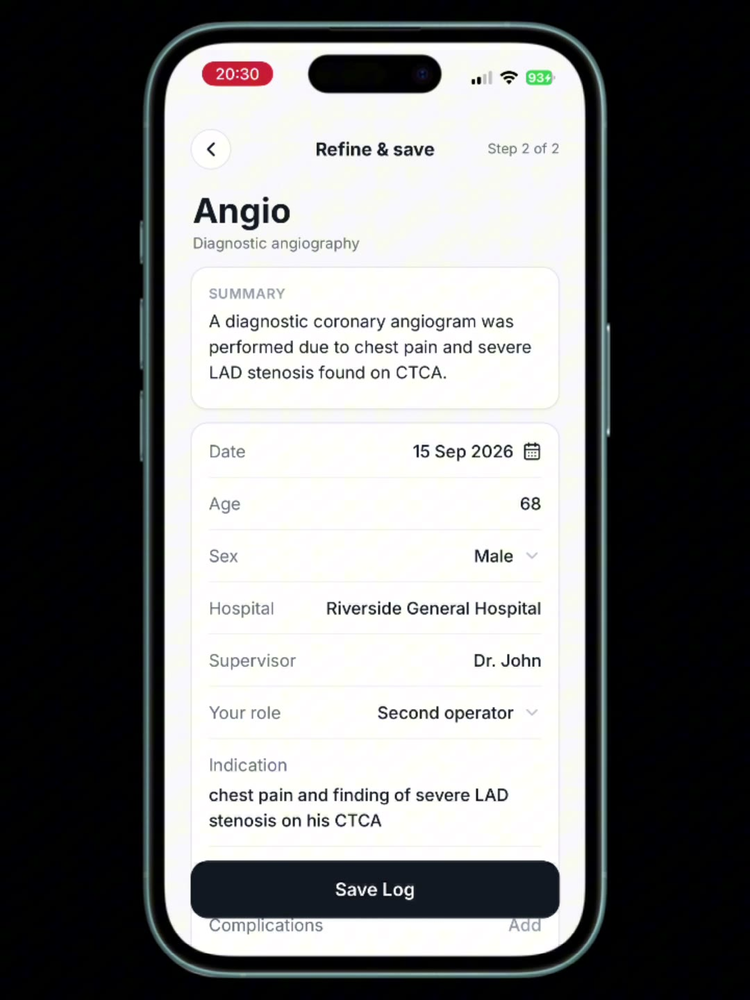
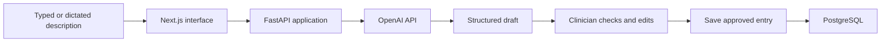

# Clinote
## An AI-assisted logbook for clinicians

**Ikechukwu Chukwudi | 50 users as of October 2026**

[Watch demo](https://realikechukwu.github.io/about/#clinote-demo) · [clinote.co](https://clinote.co/) · [Portfolio](../README.md) · [LinkedIn](https://www.linkedin.com/in/ikechukwu-chukwudi/)

## Demo

The 23-second demo shows dictation, reviewing the text, extraction into fields, saving, and the timeline.

[Watch in the portfolio](https://realikechukwu.github.io/about/#clinote-demo) · [Open the video directly](https://realikechukwu.github.io/about/assets/clinote-demo.mp4)

## The problem

Doctors have to log procedures and cases for training. It's much easier to just say what happened than to fill in a form field by field, so the logging tends to get put off.

Clinote lets you describe it in plain language and gives you back a draft entry to check and save.

## What I built

I built the whole thing: **Next.js** frontend, **FastAPI** backend, **PostgreSQL** database, and the **OpenAI API** for turning a description into structured fields. Most of the tuning went into the prompt, which took many rounds to get consistent output.

## How it works

It also has a timeline, procedure counts, and CSV/PDF export.

## Example

A made-up example of the kind of input and output involved:

**What the clinician says**

> I assisted with a dual-chamber pacemaker implantation for complete heart block. No complications. I want to reflect on sterile technique and lead positioning.

**Draft entry**

| Field | Value |
|---|---|
| Procedure | Dual-chamber pacemaker implantation |
| Indication | Complete heart block |
| My role | Assisted |
| Complications | None |
| Reflection topic | Sterile technique and lead positioning |

The clinician then corrects anything that's off and saves it.

## Design choices

**Structured output, not free text.** A logbook entry needs fields you can count and export, so the prompt is built around a fixed structure.

**Nothing is saved without review.** A neatly formatted entry can still be wrong, so the clinician always has the last look.

**Training logs only.** Clinote isn't a patient record. Users are told not to enter names, NHS numbers or dates of birth.

## What's next

I'd like to set up a proper test set of synthetic descriptions and use it to compare prompt versions on field accuracy, invented details, missing-information handling, latency and cost.

[Back to the portfolio](../README.md)
